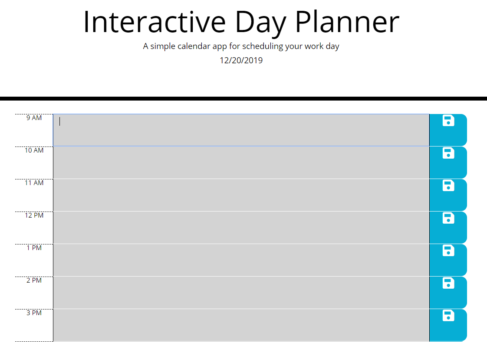
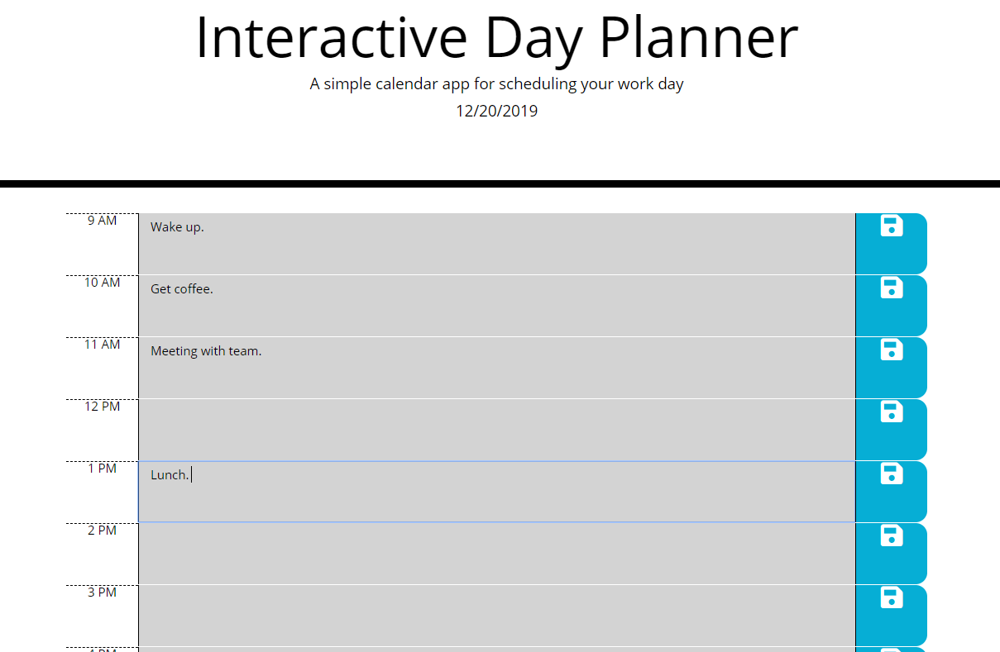
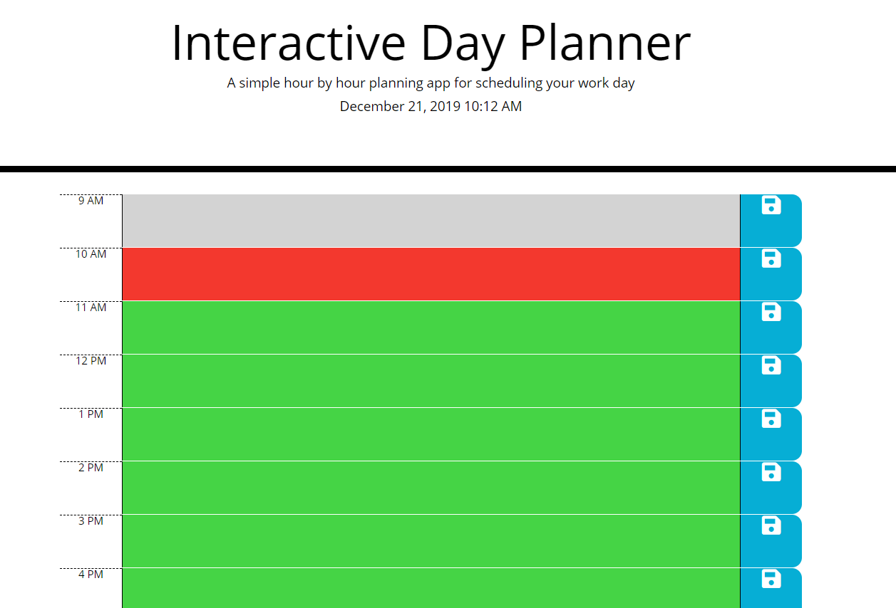

## Interactive Day Planner 

This is a dynamic and interactive day planner to schedule out your work day from 9 AM to 5 PM. 
There are hours displayed on the left with a text input field in the middle to input tasks and events throughout the work day. 
The save button on the right side will save the text input value to the local storage and remain if page is closed or refreshed. 

## Front End 

The HTML and CSS are templates taken from [https://utah.bootcampcontent.com/utah-coding-bootcamp/UofU-SAN-FSF-PT-11-2019-U-C/tree/master/05-Third-Party-APIs] That have been slightly modified with coloring and border styling. 

## Back End 
JQuery was used as well as moment.js. The moment.js code was used for keeping the time in the application. The source code for that can be found at 
[https://momentjs.com/]

## Screenshots 

## Credits
DCode [https://www.youtube.com/channel/UCjX0FtIZBBVD3YoCcxnDC4g]
W3Schools [https://www.w3schools.com/jquery/]
Help also thanks to Spencer Bangerter, and Matthew Grimes. 
